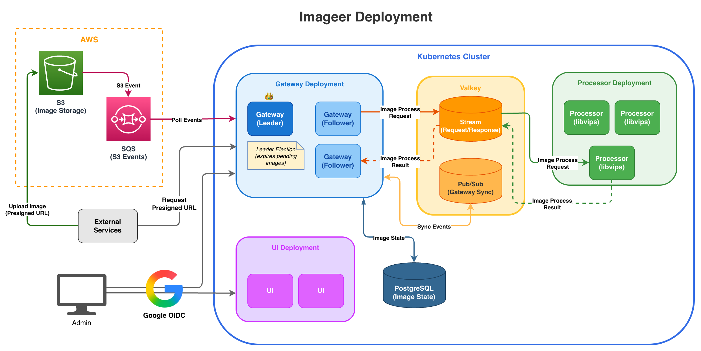
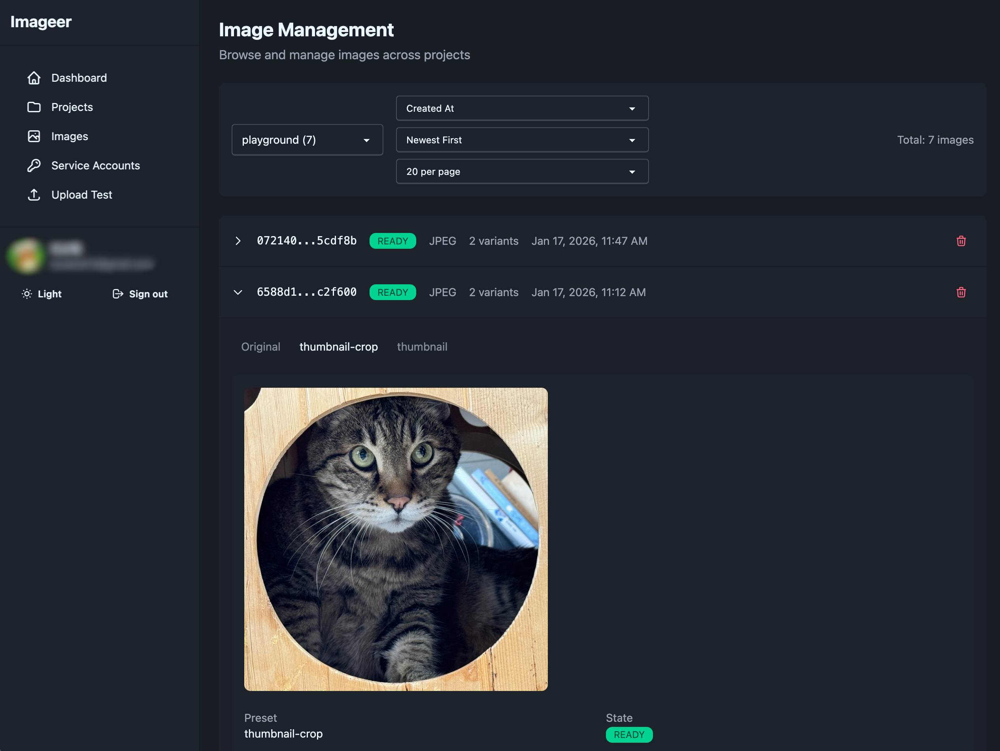
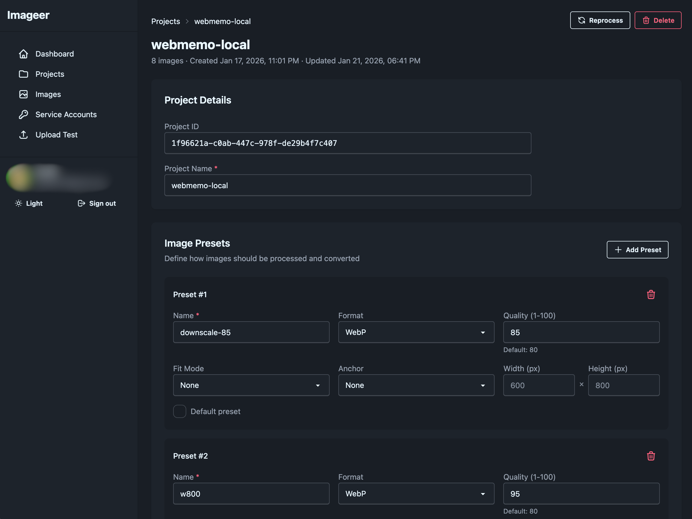
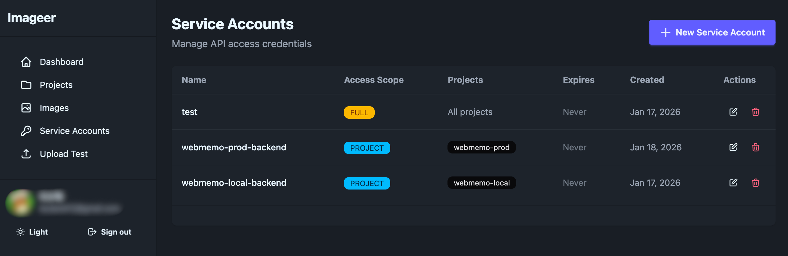
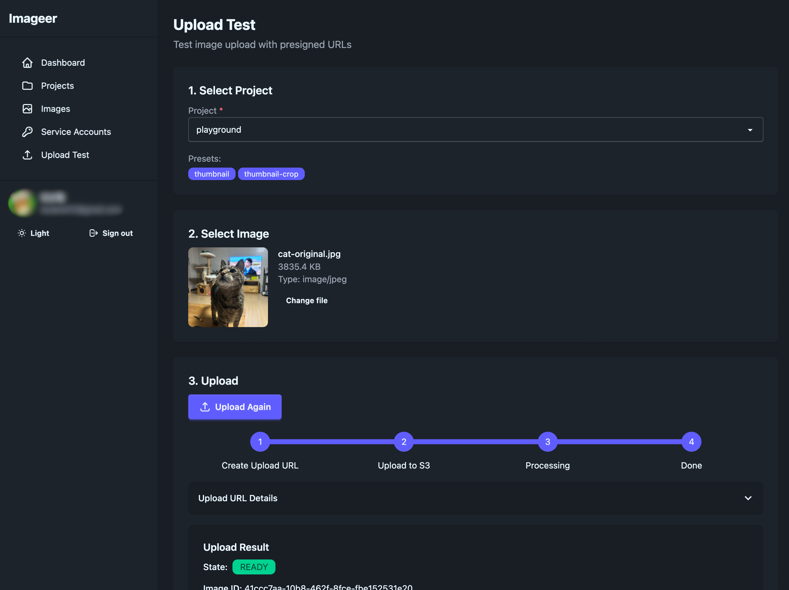

# Imageer

Imageer is a self-hosted image processing service that automatically transforms
uploaded images into multiple variants. It uses presigned URLs for secure
uploads to S3 and processes images with [bimg](https://github.com/h2non/bimg)
(libvips wrapper) workers running on Kubernetes.

## Architecture

The system runs on Kubernetes with a gateway handling upload URLs and image
metadata, processors for image transformation, and Valkey for request streaming.
PostgreSQL stores image state and Google OIDC provides authentication.



## Screenshots

### Image Management

Browse and manage images across projects. View processing status, variants, and
preview transformed images.



### Project Presets

Define image processing presets per project. Configure output format, quality,
dimensions, and fit mode for each variant.



### Service Accounts

Manage API credentials for external services. Control access scope per project
with expiration settings.



### Upload Tester

Test the upload flow with presigned URLs. Select a project, upload an image, and
verify the processing pipeline.



## Development

```bash
make help
```
